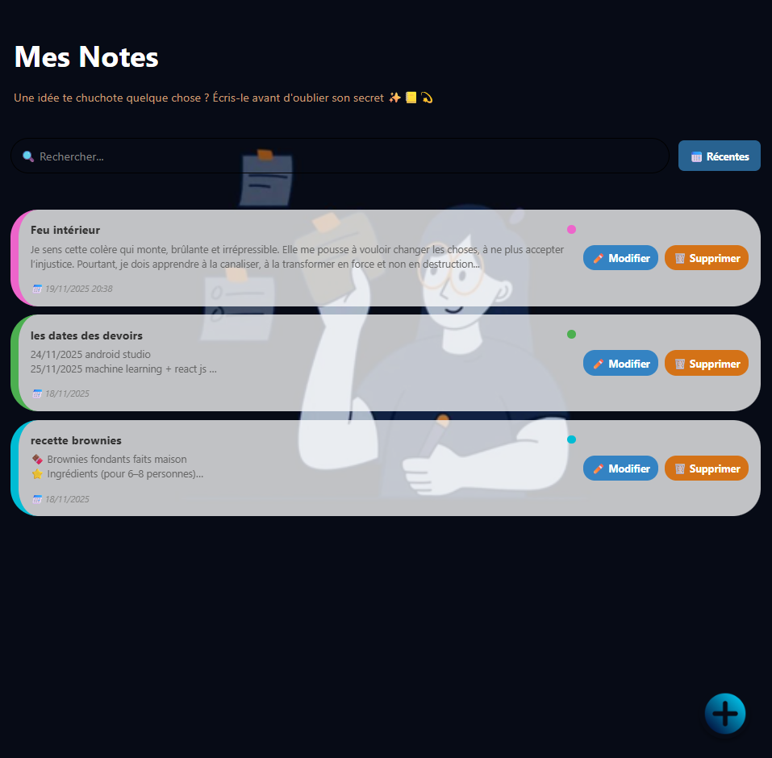
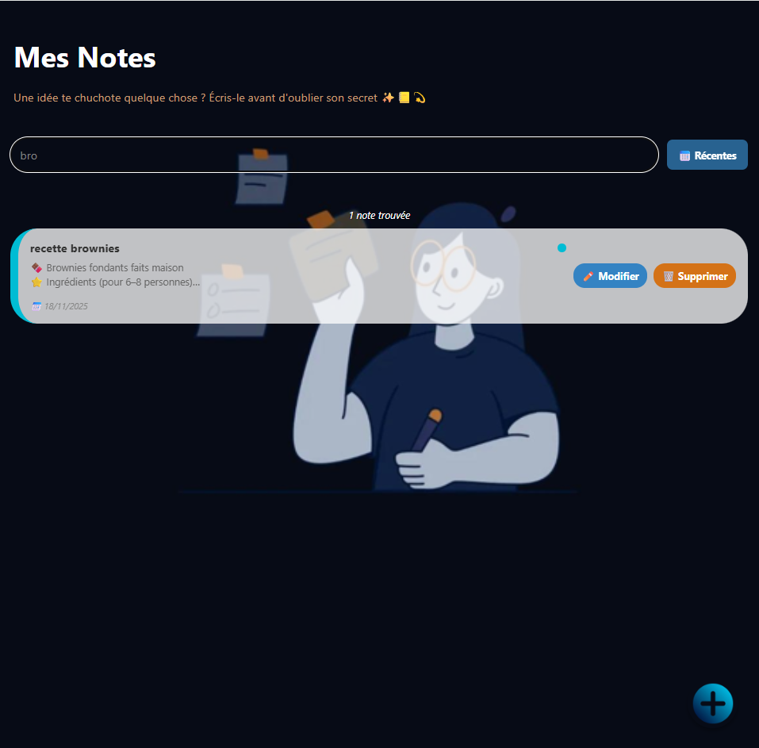

# MyNotes 📒

Application mobile React Native pour créer, modifier et gérer vos notes facilement.  
Idéale pour organiser vos idées et souvenirs.

---

## 🚀 Fonctionnalités

- Ajouter, modifier et supprimer des notes
- Recherche dans les titres et contenus
- Tri des notes par récentes, anciennes ou ordre alphabétique
- Interface intuitive et colorée
- Bouton flottant pour ajouter rapidement une nouvelle note

---

## 📸 Captures d'écran

  
  
  
  
  

---

## ⚡ Installation rapide

1. Cloner le dépôt : 

```bash 
git clone https://github.com/khalfaoui-samar/mynotes.git 
 ```

2. Installer les dépendances :

```bash
cd mynotes
npm install
```
3. Lancer l'application :

```bash
npx react-native run-android  # pour Android 
npx react-native run-ios # pour ios 
```

📝 Utilisation

Ouvrir l'application
Ajouter une nouvelle note avec le bouton "+" en bas
Modifier ou supprimer une note avec les boutons correspondants
Rechercher et trier les notes avec la barre et le bouton de tri

🛠️ Technologies utilisées

React Native
JavaScript
Context API pour la gestion des notes
React Native Gesture Handler
React Navigation

👩‍💻 Auteur

Samar Khalfaoui
📍 Jendouba, Tunisie
📧 khalfaouisamar86@gmail.com
🔗 https://github.com/khalfaoui-samar
